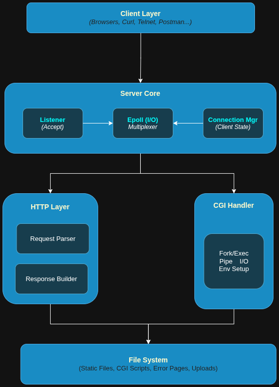
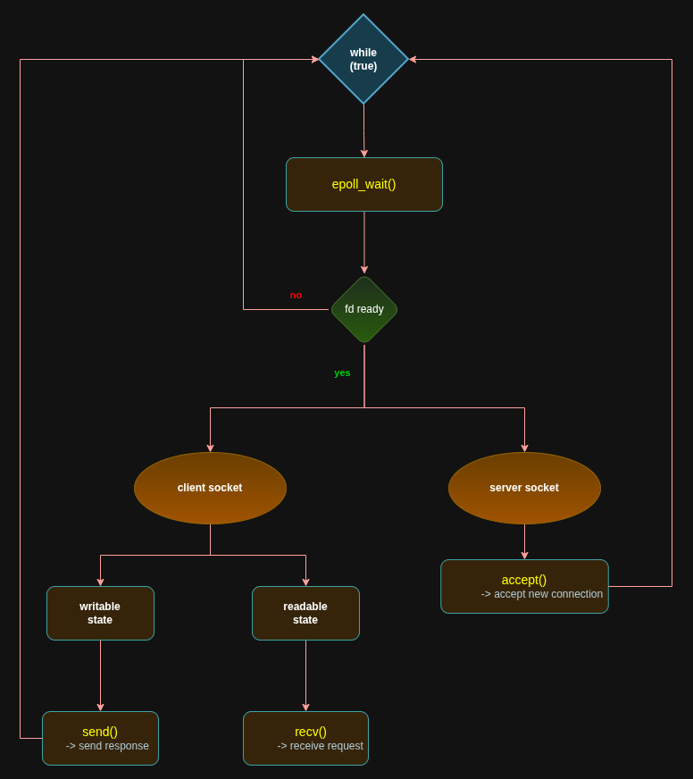

# Webserv Architecture & Design

## Overview

Webserv is a high-performance HTTP/1.0 web server written in C++98. It uses an event-driven, non-blocking I/O architecture inspired by nginx to handle thousands of concurrent connections efficiently.

### Key Design Goals

1. **Performance** - Handle multiple concurrent connections without threads
2. **Compliance** - Strict C++98 standard, no external dependencies
3. **Reliability** - Graceful error handling, no memory leaks
4. **Simplicity** - Clean code architecture, easy to understand

---

## System Architecture

### High-Level Overview

<br>

<br>

---

## Core Components

### 1. Server Core

**File:** `src/server/Server.cpp`

**Responsibilities:**
- Main event loop using epoll
- Orchestrates all other components
- Manages client connections
- Handles timeouts

**Key Methods:**
```cpp
void run();                    // Main event loop
void processServerEvent();     // Handle new connections
void processClientEvent();     // Handle client I/O
void checkClientTimeOut();     // Remove stale connections
```

**Event Loop:**

<br>

<br>

---